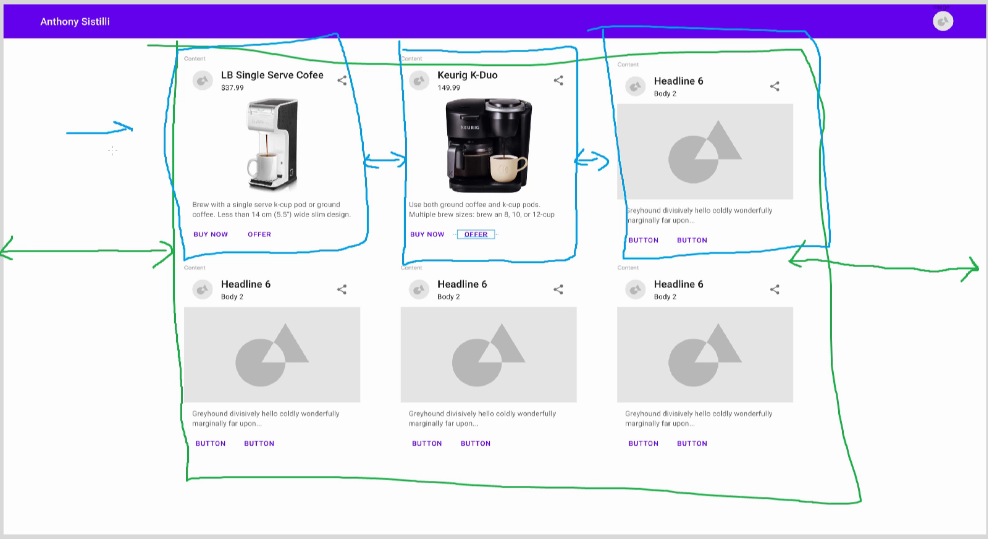

# React Material-UI practice

[Tutorial](https://www.youtube.com/watch?v=pHclLuRolzE) by Anthony Sistilli on
YouTube.

Installation:
```bash
npm install @material-ui/core
```

## 1. Intro project

### 1.1 Button

```js
import { Button } from '@material-ui/core';

<Button variant="outlined" color="secondary"> Our first button</Button>
```

Note: in vscode, you can use ctrl+space to view autocomplete options in the
JSX Component.

See Button props on website: https://material-ui.com/api/button/

### 1.2 Styling / Theme

We can create a theme object to override the
[Default Theme object](https://material-ui.com/customization/default-theme/#default-theme).

We can use [createMuiTheme](https://material-ui.com/customization/theming/#createmuitheme-options-args-theme)
to create a new Theme.

Then we can use [ThemeProvider](https://material-ui.com/styles/api/#themeprovider)
to apply the theme.

theme.js
```js
import { createMuiTheme } from '@material-ui/core/styles';
import purple from '@material-ui/core/colors/purple';
import green from '@material-ui/core/colors/green';

const theme = createMuiTheme({
  palette: {
    primary: {
      main: purple[500],
    },
    secondary: {
      main: green[500],
    },
  },
});

export default theme;
```

index.js
```js
//...
import { ThemeProvider } from '@material-ui/core';
import theme from './theme';

ReactDOM.render(
  <React.StrictMode>
    <ThemeProvider theme={theme}>
      <App />
    </ThemeProvider>
  </React.StrictMode>,
  document.getElementById('root')
);
```

### 1.3 Typograpy

Another important component is [Typography](https://material-ui.com/api/typography/).

It allows us to write text in a cleaner, more programatic way.

(Note: you can access docs link in vscode via hover)

i.e.
```js
<Typography variant='h2' color='primary'>Hello Material-UI</Typography>
// instead of
<h1>Hello Material-UI</h1>
```

### 1.4 makeStyles hook

We can use the makeStyles hook to create new styles which can be added to our
Components by passing them into the className property.
(overrides defaults + custom theme)

```js
// ...
import { makeStyles } from '@material-ui/core';

const useStyles = makeStyles({
  helloThereStyle: {
    fontStyle: 'oblique' // Add slant to text
    color: 'red',
    fontSize: '30px'
  }
});

function App() {
  const classes = useStyles();

  return (
    <div className="App">
      <Typography className={classes.helloThereStyle}>
        Hello Material-UI
      </Typography>
      <Button variant="outlined" color="secondary"> Our first button</Button>
    </div>
  );
}
// ...
```

## 2. Designing a UX Design



Installs:
```bash
npm install @material-ui/core
npm install @material-ui/icons
npm install @material-ui/styles
```

### 2.1 Grid / Layout

We can create a grid with Grid. Box can also be used if we want to fill an area
with a background colour, or create a generic box.
```js
<Grid container direction="column">
    <Grid item>
        This is where the content is
    </Grid>
    <Grid item>
        <Box bgcolor="red">This is where the content is</Box>
    </Grid>
</Grid>
```

A Grid can be a container, item, or both. Items must always be held by a
container.

We can set a grid item to a number of (12) css grid slots.
```js
<Grid container direction="column">
<Grid item>
    <Box bgcolor='blue'>APP BAR</Box>
</Grid>
<Grid item container>
    <Grid item xs={null} sm={2} />
    <Grid item xs={12} sm={8}><Box bgcolor='red'>CONTENT</Box></Grid>
    <Grid item xs={null} sm={2} />
</Grid>
</Grid>
```
(full page on extra small+, size 2 gutters on small+)

### 2.2 Header / Appbar

You can search all the icons from [here](https://material-ui.com/components/material-icons/).

**FORMATTTING:**

If we want an item to grow in the AppBar, and push other items to the right side,
we can either use:
* `useStyle` with `flexGrow: 1,` on a middle item
* `Grid` to create 12 point proprotions
* `flex=1` to proportionally fill space with elements


### 2.3 Content

We will use a Grid for the actual content.

We can use `spacing={2}` on the grid container to add spacing between
grid items.

CoffeeCard.js:
```js
// ...
const useStyle = makeStyles(theme => ({
  gridPadding: {
    padding: '50px',
  },
}));

const Content = () => {
  const classes = useStyle();

  const coffees = data.map(coffee => {
    const { title, price, description, avatarUrl, imageUrl } = coffee;
    return (
      <Grid item xs={12} sm={6} md={4}>
        <CoffeeCard
          title={title}
          subtitle={price}
          description={description}
          avatarSrc={avatarUrl}
          imgSrc={imageUrl}
        />
      </Grid>
    );
  });

  return (
    <Grid container spacing={2} className={classes.gridPadding}>
      {coffees}
    </Grid>
  );
}
```

Content.js
```js
// ...
const useStyle = makeStyles(theme => ({
  gridPadding: {
    padding: '50px',
  },
}));


const Content = () => {
  const classes = useStyle();

  const coffees = data.map(coffee => {
    const { title, price, description, avatarUrl, imageUrl } = coffee;
    return (
      <Grid item xs={12} sm={6} md={4}>
        <CoffeeCard
          title={title}
          subtitle={price}
          description={description}
          avatarSrc={avatarUrl}
          imgSrc={imageUrl}
        />
      </Grid>
    );
  });

  return (
    <Grid container spacing={2} className={classes.gridPadding}>
      {coffees}
    </Grid>
  );
}
```

### 2.4 makeStyles