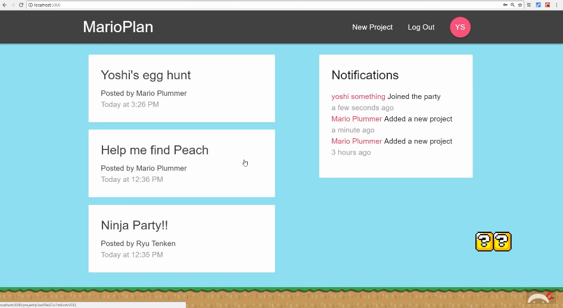
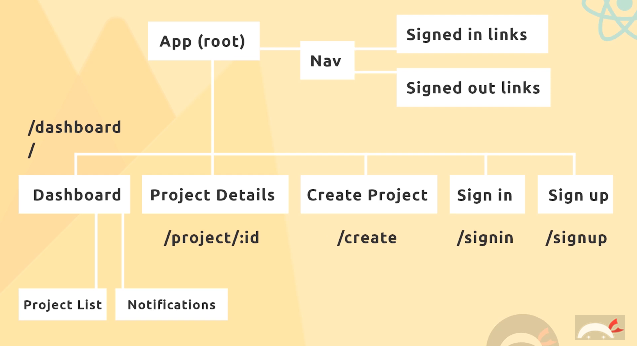
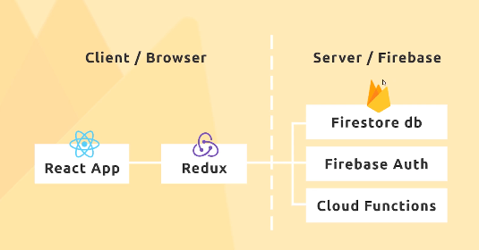
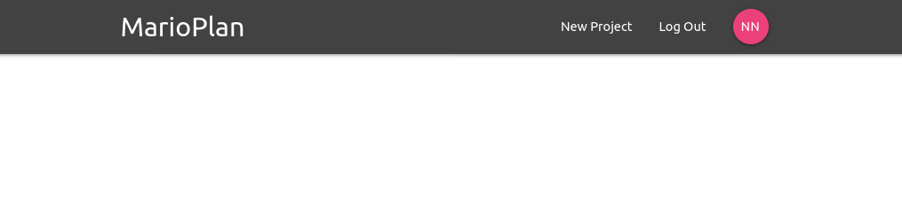
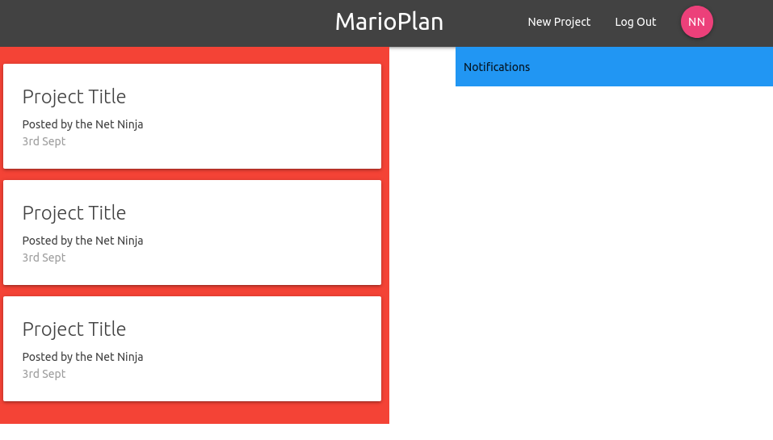
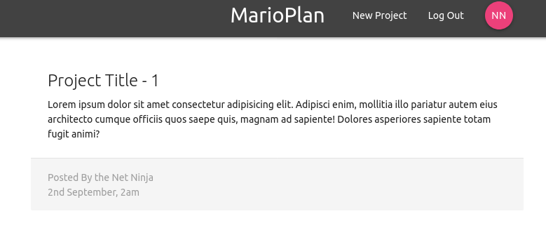
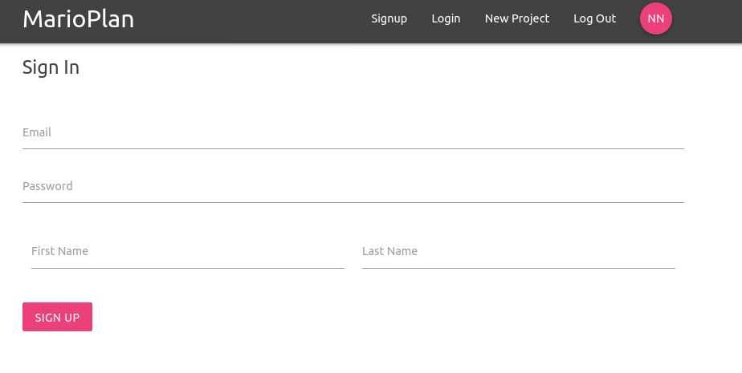
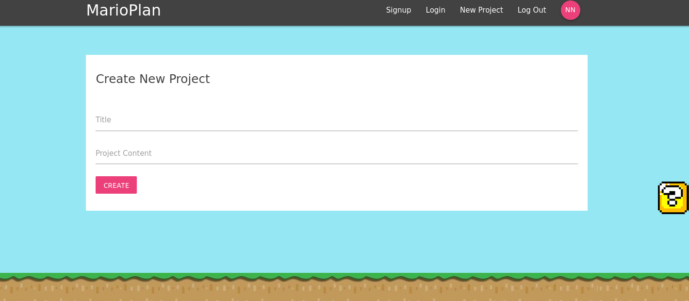
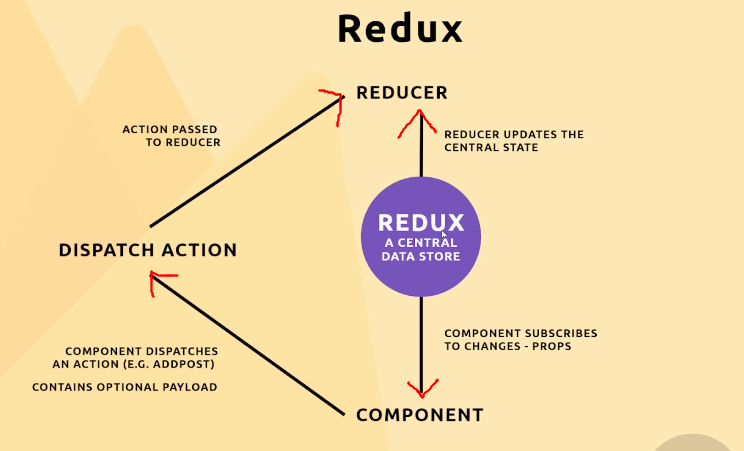

# React, Redux & Firebase App Tutorial

[Tutorial](https://www.youtube.com/playlist?list=PL4cUxeGkcC9iWstfXntcj8f-dFZ4UtlN3)
by [The Net Ninja](https://www.youtube.com/channel/UCW5YeuERMmlnqo4oq8vwUpg) on YouTube.

- [React, Redux & Firebase App Tutorial](#react-redux--firebase-app-tutorial)
  - [Intro](#intro)
  - [1. Basic React App](#1-basic-react-app)
    - [1.1 Getting Started](#11-getting-started)
    - [1.2 NavBar Component](#12-navbar-component)
    - [1.3 Dashboard Component](#13-dashboard-component)
    - [1.4 ProjectSummary & ProjectDetails Components](#14-projectsummary--projectdetails-components)
    - [1.5 Signin & Signup Components](#15-signin--signup-components)
    - [1.6 Create Project Component](#16-create-project-component)
    - [1.7 Styling](#17-styling)
  - [2. Redux](#2-redux)
    - [2.1 Setting up Redux and Reducers](#21-setting-up-redux-and-reducers)
    - [2.2 Using Redux and Reducers](#22-using-redux-and-reducers)
    - [2.3 Redux Thunk for async Actions](#23-redux-thunk-for-async-actions)


## Intro

We will be using:
* React & Redux
* Thunk (package for asyncronous code)
* Firebase (Firestore, Auth, Cloud Functions, Hosting)








## 1. Basic React App

### 1.1 Getting Started

Initialise an app:
```bash
npx create-react-app marioplan
cd marioplan
npm start
```

We will use [MaterializeCSS](https://materializecss.com/getting-started.html)
to easily style our website. CDN:
```html
    <!-- Compiled and minified CSS -->
    <link rel="stylesheet" href="https://cdnjs.cloudflare.com/ajax/libs/materialize/1.0.0/css/materialize.min.css">
    <!-- Compiled and minified JavaScript -->
    <script src="https://cdnjs.cloudflare.com/ajax/libs/materialize/1.0.0/js/materialize.min.js"></script>
```

We will structure the code as:
```
src
├── App.js
├── components
│   ├── auth
│   │   ├── SignIn.js
│   │   └── SignUp.js
│   ├── dashboard
│   │   ├── Dashboard.js
│   │   └── Notifications.js
│   ├── layout
│   │   ├── Navbar.js
│   │   ├── SignedInLinks.js
│   │   └── SignedOutLinks.js
│   └── projects
│       ├── CreateProject.js
│       ├── ProjectDetails.js
│       ├── ProjectList.js
│       └── ProjectSummary.js
├── index.css
├── index.js
└── serviceWorker.js
```

### 1.2 NavBar Component

NavBar:
* `<nav>` tags are automatically styled and positioned by Materialize
* The `SignedInLinks` or `SignedOutLinks` component will show a set of nav links depending on whether the user is logged in.
* `<NavLink>` component makes it easy to make Nav entries.

It is easy to style using Materialize:
* Profile button: `nav-wrapper grey darken-3`
* Navbar colours:`btn btn-floating pink lighten-1`
* Homepage button: `brand-logo`



### 1.3 Dashboard Component

Dashboard:
* Left side (ProjectList), Right side (Notification)
* The cards will be styled with MaterializeCSS cards
* Materialize grid: `row red` (row) and `col s12 m6 blue` (column, fill 12 cells on small [the 2 columns are placed in stacks], 6 cells on medium [the two columns are side-by-side])

We will also add propper routing.



### 1.4 ProjectSummary & ProjectDetails Components

We will modularise the cards from `ProjectList` into `ProjectSummary`
(stateless widget).

We will initialise a page called `ProjectDetails` to hold information about the
project.



### 1.5 Signin & Signup Components

We will create forms for sign up and sign in.

The handle change and submit functions are important.
```js
  handleChange = (e) => {
    this.setState({
      [e.target.id]: e.target.value
    });
  }

  handleSubmit = (e) => {
    e.preventDefault();
    alert('submitted');
  }
```

Material forms are super easy, look amazing and are animated!



### 1.6 Create Project Component

This will be a similar for as SignIn and SignUp.

### 1.7 Styling

We can style the website with CSS:
* Background image
* Padding on forms
* Underline colour on input elements



## 2. Redux



* **Store** is like the warehouse (`createStore(reducer)`)
* **Reducers** are like robots that are allowed inside the warehouse to update the store (`func`)
* **Actions** are a request to a reducer to do one of its actions in the store (`store.dispatch(obj)`)
* We can also **subscribe** to the store (`store.subscribe(() => {store.getState()}))`)


### 2.1 Setting up Redux and Reducers

```bash
cd marioplan
npm install redux react-redux
```

We will create:
* authReducer
* projectReducer
* rootReducer (combines the two other reducers)

We can utilise the rootReducer in index.js:
```js
import { createStore } from 'redux'
import { Provider } from 'react-redux'
import rootReducer from './store/reducers/rootReducer'

const store = createStore(rootReducer);

ReactDOM.render(
  <React.StrictMode><Provider store={store}><App /></Provider></React.StrictMode>,
  document.getElementById('root')
);
```

### 2.2 Using Redux and Reducers

We can retrieve global state from the root reducer:
```js
import React, { Component } from 'react'
import { connect } from 'react-redux'

import Notifications from './Notifications'
import ProjectList from '../projects/ProjectList'


class Dashboard extends Component {
  render() {
    const { projects } = this.props; // Set by mapStateToProps
    return (
      <div className="dashboard">
        <div className="row">
          <div className="col s12 m6">
            <ProjectList projects={projects} />
          </div>
          <div className="col s12 m5 offset-m1">
            <Notifications />
          </div>
        </div>
      </div>
    )
  }
}

const mapStateToProps = (state) => {
  return { projects: state.project.projects } // Obtained from provider store
}

export default connect(mapStateToProps)(Dashboard)
```

`connect` will allow us to use a function to obtain props from the provider
store (which is set using rootReducer).

Now we can pass the global state from the Dashboard to child components.

### 2.3 Redux Thunk for async Actions

We can use Thunk to retrieve data after a component dispatches an action and
before the action is passed to the reducer.

```bash
npm install redux-thunk
```

We can use `applyMiddleware` to add thunk.
```js
import { createStore, applyMiddleware } from 'redux'
// ...
const store = createStore(rootReducer, applyMiddleware(thunk));
```

Then we can add a function with the dispatch to the props of a component, so
it can use the function.
```js
const mapDispatchToProps = (dispatch) => {
  return {
    createProject: (project) => dispatch(createProject(project))
  }
}

export default connect(null, mapDispatchToProps)(CreateProject)
```

CreateProject (component) >>>handleSubmit>>>
**createProject** (action) >>>dispatch>>>
projectReducer (reducer)

Thunk allows us to use `mapDispatchToProps` to add a function to the props of
the CreateProject Component (I think).